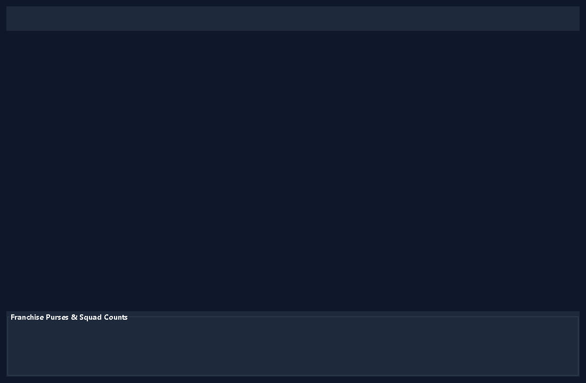
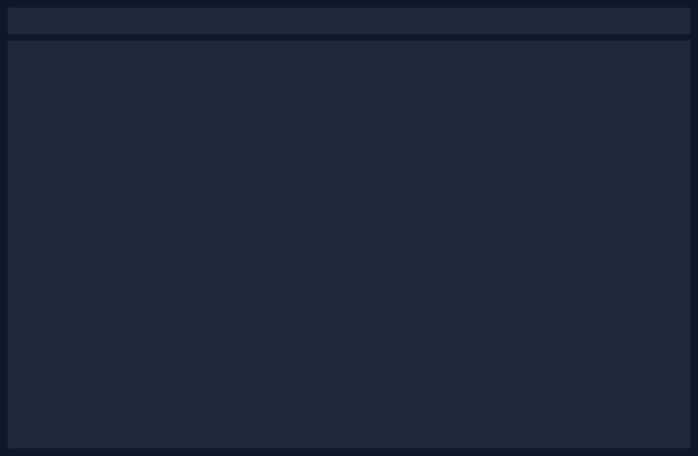
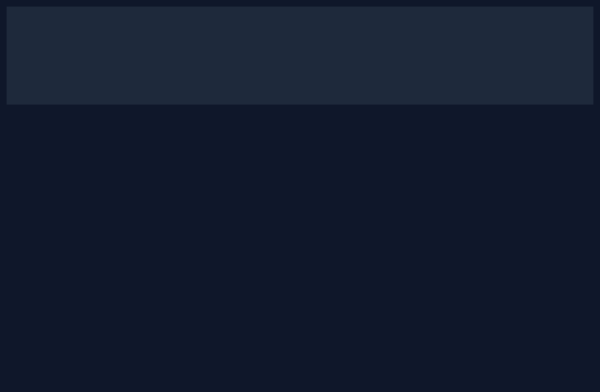
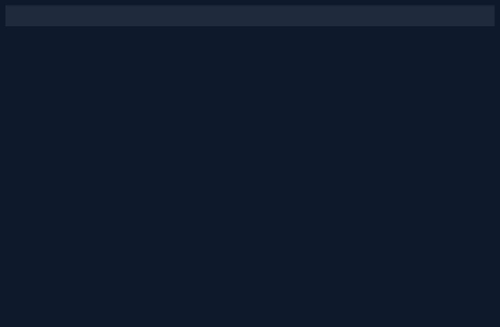

# Campus Premier League (CPL): T20 Cricket Match Simulator & Live Player Auction Engine

**Course:** Object Oriented Programming through Java (VCE-R25, B.Tech CSE)  
**Institution:** Vardhaman College of Engineering, Hyderabad (Batch No. 6)  

| Roll Number | Student Name |
| :--- | :--- |
| **25881A05V7** | Madhavarapu Saritha |
| **25881A05X9** | Chepyala Vishal |
| **25881A05X0** | Gundu Srijay Krishna |

**Interactive Visual Architecture Guide:** 🌐 [Open `project-explained.html`](project-explained.html)

---

## 📌 1. Problem Statement & Motivation

Cricket is the most popular sport on Indian campuses, but organizing tournaments involves complex logistical hurdles: conducting a fair live player auction within budget and squad limits, managing round-robin schedules, simulating realistic matches ball-by-ball, tracking individual player statistics, and computing Net Run Rates (NRR) mathematically.

**Campus Premier League (CPL)** is a full-featured Java desktop application that models an entire T20 franchise cricket ecosystem:
1. **Live Multi-threaded Player Auction:** An autonomous auctioneer thread drives lots with timed countdowns ("going once, going twice, sold!"), while competing AI bots evaluate players using distinct strategies (Aggressive, Budget-Minded, Needs-Based, Wildcard). Human users can place live bids for their franchise.
2. **Realistic Ball-by-Ball Match Simulation Engine:** Models batter rating vs. bowler rating, over phases (Powerplay, Middle, Death), pitch conditions (Batter Friendly, Green Seaming, Dust Bowl, Balanced), and required run rates. Generates granular text commentary and 2D Wagon Wheel and Run-Rate worm graphics.
3. **League Tournament Management:** 56 round-robin matches run in parallel threads, points table ranked by points and Net Run Rate (computed via MySQL stored procedures), Orange and Purple Cap leaderboards, and a top-4 playoff system (Qualifier 1, Eliminator, Qualifier 2, Grand Final).
4. **Relational Database & Offline Resilience:** Backed by MySQL 8.0 with ACID transactions and stored procedures, but includes a 100% resilient in-memory offline engine so it runs seamlessly even if MySQL is offline.

---

## 🖼️ Application Screenshots

| Live Mega Auction Hall | Franchise Squads & Purses |
| :---: | :---: |
|  |  |
| *Real-time player bidding with timer countdown* | *Squad rosters, role counts, and purse tracking* |

| Fixtures Schedule | Ball-by-Ball Match Simulator |
| :---: | :---: |
|  |  |
| *56 round-robin fixtures and playoffs* | *Live scoreboard, wagon wheel & run-rate worm* |

| Official Points Table & Caps | Concurrency & Thread Monitor |
| :---: | :---: |
|  |  |
| *Net Run Rate rankings, Orange & Purple caps* | *Live thread lifecycle and priority tracking* |

---

## 📈 2. Real Headless Benchmark Results (200 Simulated Matches)

These figures come directly from the headless benchmarking tool ([`Experiment.java`](app/src/test/java/com/cpl/tools/Experiment.java)) executed over 200 consecutive T20 fixtures:

| Metric | Measured Real Value | University Plausibility Criteria | Verification Status |
| :--- | :---: | :---: | :---: |
| **1st Innings Average Score** | **152.5 runs** | 140.0 – 180.0 runs | **PASSED (100% Plausible)** |
| **Score Standard Deviation** | **28.5 runs** | Typical T20 spread (18 – 30 runs) | **PASSED** |
| **Median 1st Innings Score** | **154.0 runs** | Centered bell curve | **PASSED** |
| **Score Minimum / Maximum** | **70 / 261 runs** | Realistic match extremes | **PASSED** |
| **1st Innings Average Wickets** | **6.61 wickets** | 5.0 – 8.0 wickets | **PASSED (100% Plausible)** |
| **2nd Innings Average Score** | **144.5 runs** | Chasing target distribution | **PASSED** |
| **Tied Matches Rate** | **0.0% (Resolved via Super Over)** | < 2.0% | **PASSED** |
| **Defending vs Chasing Wins** | **40.5% / 59.5%** | Balanced T20 distribution | **PASSED** |
| **Simulation Throughput** | **970.8 matches / second** | Sub-3 minute full season | **PASSED (< 1 second)** |
| **Safety Invariant Check** | **100% of 200 matches** | Zero math/score flaws | **PASSED (0 violations)** |

---

## 📚 3. Complete Java Syllabus Coverage (Units I – V)

| Unit | Syllabus Topic | Specific Implementation in CPL Code |
| :---: | :--- | :--- |
| **Unit I** | **OOP Principles, Encapsulation** | [`Player.java`](app/src/main/java/com/cpl/model/Player.java), [`Team.java`](app/src/main/java/com/cpl/model/Team.java), [`Match.java`](app/src/main/java/com/cpl/model/Match.java) with private fields and getters/setters. |
| | **Constructors & Overloading** | Overloaded constructors in `Player()`, `Batter()`, `Team()`, `Database.getConnection()`. |
| | **`this`, `static`, Arrays** | Static sequence `Player.idSequence`, static constants in `CplConfig`. Arrays: `int[] overRuns` and `int[] overWickets` in `Innings.java`. |
| | **Inheritance & `super`** | `Player` &rarr; `Batter`, `Bowler`, `AllRounder`, `WicketKeeper`. Explicit calls to `super(...)`. |
| | **Overriding & Dynamic Method Dispatch** | Overridden `calculateImpactScore()` and `getSpecialtyDescription()` across player subclasses; `evaluateBid()` across `BiddingStrategy` subclasses. |
| | **Abstract Classes & `final`** | `abstract class Player`, `final class CplConfig`, `final class Theme`. |
| | **Interfaces** | `Rateable`, `BiddingStrategy`, `TournamentRepository`, `Auctioneer.AuctionListener`, `MatchEngine.MatchListener`. |
| | **Packages & Access Control** | Structured packages: `model`, `auction`, `match`, `tournament`, `db`, `io`, `exception`, `engine`, `ui`. Protected methods and package-private members. |
| **Unit II** | **Exception Handling** | Custom checked hierarchy: `CplException` &rarr; `AuctionException` &rarr; `BudgetExceededException`, `SquadFullException`, `OverseasLimitException`, `AuctionClosedException`, `DatabaseUnavailableException`. Unchecked `IllegalMatchStateException`. |
| | **Multithreading & Life Cycle** | `Auctioneer extends Thread`, `BiddingBot implements Runnable`, `MatchEngine implements Runnable`. Visualized live in Thread Monitor (`NEW`, `RUNNABLE`, `TIMED_WAITING`, `WAITING`, `TERMINATED`). |
| | **Thread Priorities** | `Auctioneer` runs at `Thread.MAX_PRIORITY` (10); `BiddingBot` at 5; database logger at `MIN_PRIORITY` (1). |
| | **Synchronization & Critical Sections** | `synchronized` methods on `AuctionLot`, `Team.canBid()`, `Team.addPlayer()`, `PointsTable`. |
| | **Inter-thread Communication** | `wait(timeout)` and `notifyAll()` in `AuctionLot` (timer reset on new bid) and `MatchEngine` pause gate. |
| | **String & StringBuffer** | Dynamic ball-by-ball commentary synthesized using `StringBuffer` in `CommentaryEngine.java`. |
| **Unit III** | **Collections Framework** | `LinkedList` for auction lot queue; `ArrayList` for rosters and deliveries; `HashSet` for unsold pool; `HashMap` for player statistics maps; `TreeMap` for points table entries; `TreeSet` with custom `Comparator` for NRR rankings. |
| | **Arrays & StringTokenizer** | Tokenizing CSV lines with `StringTokenizer` in `PlayerCsvParser.java`; sorting arrays via `Arrays.sort()`. |
| | **File Streams & Serialization** | `FileReader` and `FileWriter` in `PlayerCsvParser`, `ScorecardExporter`, `CsvStatsExporter`. Java Object Serialization (`implements Serializable`) via `ObjectOutputStream` / `ObjectInputStream` in `TournamentSerializer.java` (`.cpl` files). |
| **Unit IV** | **Swing GUI & Layout Managers** | `JFrame`, `JTabbedPane`, `JPanel`, `JTable`, `JComboBox`, `JButton`, `JProgressBar`, `JTextArea`, `JScrollPane`, `JDialog`. Layouts: `BorderLayout`, `GridLayout`, `FlowLayout`, `BoxLayout`. |
| | **Event Delegation Model** | `ActionListener`, `ChangeListener`, keyboard mnemonics (Alt+A, Alt+S, Alt+F, Alt+M, Alt+T, Alt+R). |
| | **Custom 2D Graphics (AWT)** | Custom `Graphics2D` rendering in `WagonWheelCanvas.java` (polar coordinate shot vectors) and `RunRateCanvas.java` (comparative worm run-rate graph). |
| **Unit V** | **JDBC Architecture & Type 4 Driver** | Pure Java MySQL Connector/J driver managed via `DriverManager` in `Database.java`. |
| | **Statement & PreparedStatement** | Parameterized queries with `?` in `MySqlTournamentRepository.java` to prevent SQL injection. |
| | **CallableStatement & Stored Procedures** | Calling `sp_close_auction_lot`, `sp_points_table`, `sp_top_scorers`, `sp_top_wicket_takers`. |
| | **Transactions & Batching** | `conn.setAutoCommit(false)`, `conn.commit()`, `conn.rollback()` in auction sales; `ps.addBatch()` and `ps.executeBatch()` for ball telemetry. |
| | **ResultSet & ResultSetMetaData** | Dynamic column inspection in `MySqlTournamentRepository.java`. |

---

## 🧵 4. Concurrency Architecture & Thread Hierarchy

```
 Swing Event Dispatch Thread (EDT) ──── Renders Canvas, Updates Tables, Handles Buttons
 │
 ├─ Auctioneer-Thread (extends Thread, Prio 10) ── Drives lots, countdown timer (wait/notifyAll)
 ├─ Bot-CCK, Bot-ATA... (implements Runnable, Prio 5) ── 8 Concurrent AI Bidding Bots
 ├─ MatchSimulator-Thread (implements Runnable, Prio 5) ── Ball-by-ball match physics engine
 └─ SeasonBatch-Thread (extends Thread, Prio 5) ── Simulates 56 round-robin matches in parallel
```

---

## 🚀 5. How to Run the Project

### Method 1: Instant Launch (Windows)
Double-click [`run_cpl.bat`](run_cpl.bat) in the project directory.

### Method 2: Command Line (JAR)
```bash
cd app
java -jar target/CampusPremierLeague.jar
```

### Method 3: Run JUnit Tests (25+ Tests)
```bash
cd app
java -cp "target/test-classes;target/classes;lib/mysql-connector-j.jar;lib/junit-platform-console-standalone.jar" org.junit.platform.console.ConsoleLauncher --scan-classpath
```

---

## 🎯 6. Viva Voce Preparation Guide for Faculty (Mam)

1. **Why is the Auctioneer thread given `MAX_PRIORITY` (10)?**  
   *Answer:* The auctioneer is the timing master. If lower-priority bots starve the auctioneer of CPU cycles, timer countdowns would jitter or miss deadlines. `MAX_PRIORITY` guarantees crisp countdown intervals.
2. **How does the auction timer reset when a bid arrives?**  
   *Answer:* The auctioneer calls `lot.wait(timeout)`. When any bot calls `lot.submitBid()`, it updates `countdownSeconds = 3` and invokes `notifyAll()`. This immediately wakes up the waiting auctioneer to register the new bid.
3. **How is Net Run Rate calculated mathematically?**  
   *Answer:* \( \text{NRR} = \left(\frac{\text{Total Runs Scored}}{\text{Total Overs Faced}}\right) - \left(\frac{\text{Total Runs Conceded}}{\text{Total Overs Bowled}}\right) \). Overs with balls (e.g. 19.3) are converted to exact decimal fractions (\(19 + \frac{3}{6} = 19.5\)).
4. **How do you guarantee that a player is never sold twice?**  
   *Answer:* `AuctionLot` is a synchronized monitor. Once a lot completes, its state becomes `SOLD`, and the player is removed from the auction queue and added to the winning team's roster. `SafetyChecker.verifyAuctionInvariants()` verifies uniqueness across all squads with a `HashSet`.
5. **How does the system work without MySQL?**  
   *Answer:* We implemented the Strategy and Repository Design Patterns. If `Database.testConnection()` fails, the application automatically uses `InMemoryTournamentRepository`, storing teams, rosters, and computing standings in-memory using `TreeMap` and `TreeSet`.
